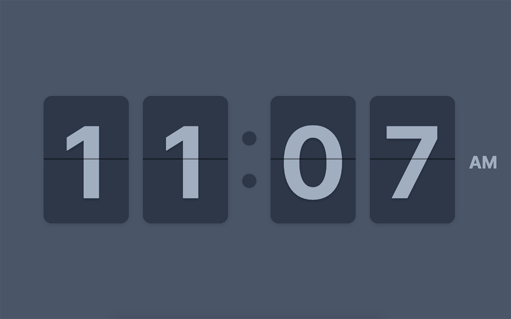

  <h1>flip-time</h1>
  <kbd>
    
  </kbd>

  

    minimalist flip clock displays time on each new tab
  

  
  <a href="https://chrome.google.com/webstore/detail/flip-time/apbapccfgemhlnbckbjjdbkpbkllbbib?hl=en&authuser=0">Download Here</a>

    

---

    
built with ❤️ by <a href="https://colby.sh">colby</a>

